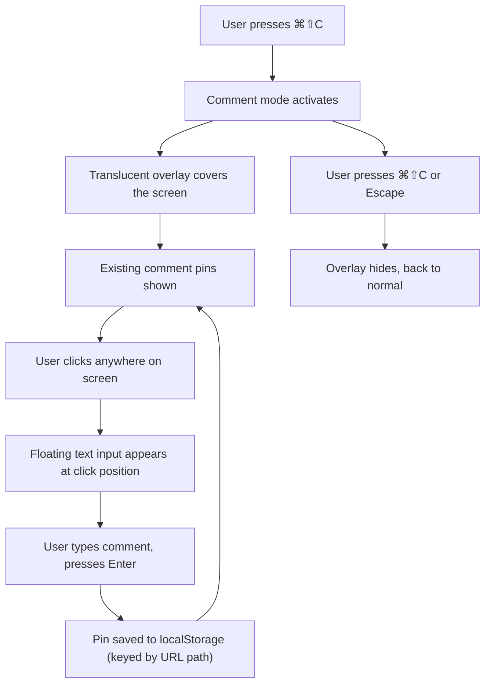

# Prototype Annotation Tool

## How It Works




## Architecture: Standalone Tool Outside the Admin Panel

The tool lives at `annotation-tool/` in the project root — completely separate from the admin panel. To use it on any prototype, you add one path alias and wrap the app with one component.

```
15_BAM-Labs/
├── annotation-tool/         ← NEW: portable, standalone tool
│   ├── src/
│   │   ├── types.ts           ← Annotation data type
│   │   ├── store.ts           ← Zustand store (localStorage)
│   │   ├── provider.tsx       ← Main provider + ⌘⇧C listener
│   │   ├── overlay.tsx        ← Full-screen overlay (comment mode)
│   │   ├── comment-pin.tsx    ← Numbered pin marker on screen
│   │   └── comment-input.tsx  ← Floating input on click
│   └── index.ts               ← Exports AnnotationProvider
└── admin-panel/             ← Existing app
```

## Data Model

Comments stored in `localStorage` keyed by URL pathname (`/users`, `/routines`, etc.):

```ts
interface Annotation {
  id: string
  x: number        // % of screen width (responsive)
  y: number        // % of screen height
  text: string
  page: string     // window.location.pathname
  createdAt: number
}
```

## "Installation" into the Admin Panel (3 changes)

**1. `[admin-panel/vite.config.ts](admin-panel/vite.config.ts)`** — add a path alias:

```ts
'@annotation-tool': path.resolve(__dirname, '../annotation-tool/src')
```

**2. `admin-panel/tsconfig.json`** — add the same path for TypeScript:

```json
"paths": { "@annotation-tool": ["../annotation-tool/src/index.ts"] }
```

**3. `[admin-panel/src/main.tsx](admin-panel/src/main.tsx)`** — wrap the app with one line:

```tsx
import { AnnotationProvider } from '@annotation-tool'
// ...
<AnnotationProvider>
  <RouterProvider router={router} />
</AnnotationProvider>
```

## UX Details

- **Activation**: `⌘+Shift+C` toggles comment mode on/off (Cmd+C is native copy — can't override it safely)
- **Active state**: a subtle blue-tinted overlay + crosshair cursor + a small floating badge showing "Comment Mode • ⌘⇧C to exit"
- **Comment pins**: yellow numbered circles at the saved x/y positions; click a pin to expand its text, click again to collapse
- **New comment**: click anywhere on the overlay → floating input anchors to that point → Enter saves, Escape cancels
- **Per-page**: switching routes clears/loads the correct set of pins automatically
- **No auth needed**: completely anonymous, no backend

## To Use on Future Prototypes

Copy `annotation-tool/` to the other project, add the same alias and tsconfig path, wrap the root with `<AnnotationProvider>` — done.