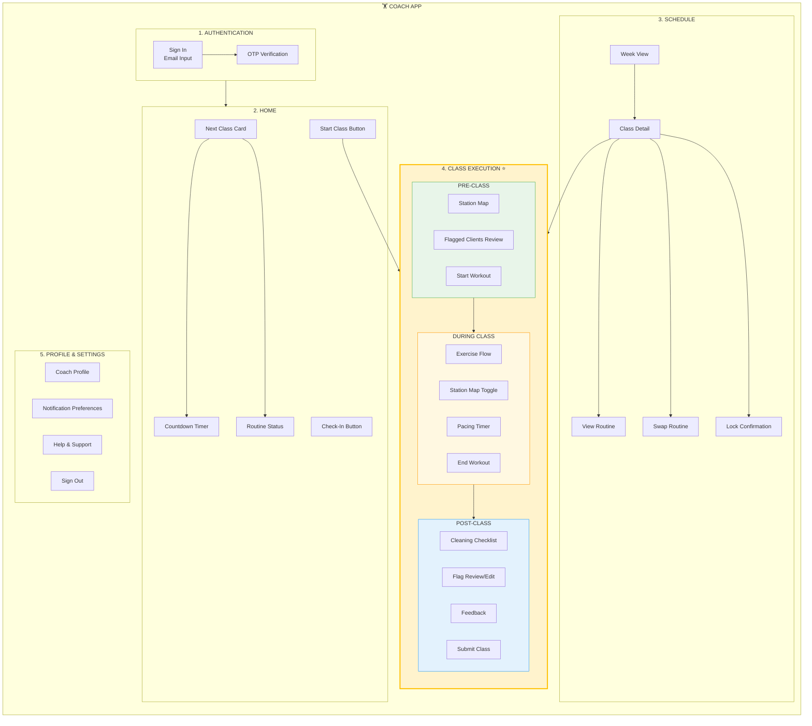

# BAM Labs Coach App – IA Visual Diagram

## Mermaid Diagram (Render in any Mermaid-compatible tool)



---

## Simplified Tree View

```
COACH APP
│
├── 1. AUTHENTICATION
│   ├── Sign In (Email)
│   └── OTP Verification
│
├── 2. HOME ◄─── Primary Landing
│   ├── Next Class Card
│   │   ├── Countdown Timer
│   │   └── Routine Status (Swappable/Locked)
│   ├── Check-In Button
│   └── Start Class Button ──────────────┐
│                                        │
├── 3. SCHEDULE                          │
│   ├── Week View (Vertical List)        │
│   │   └── Class Cards                  │
│   └── Class Detail                     │
│       ├── View Routine                 │
│       ├── Swap Routine (>12h)          │
│       ├── Lock Confirmation            │
│       └── Start Class Button ──────────┤
│                                        │
├── 4. CLASS EXECUTION ◄─────────────────┘ ⭐ CORE
│   │
│   ├── PRE-CLASS
│   │   ├── Station Map (Grid View)
│   │   ├── Flagged Clients Review
│   │   └── [Start Workout]
│   │
│   ├── DURING CLASS
│   │   ├── Exercise Flow
│   │   │   ├── Current Exercise
│   │   │   ├── Sets/Reps/Weights
│   │   │   ├── Pacing Timer
│   │   │   └── [Finish Exercise]
│   │   ├── Station Map (Toggle)
│   │   │   └── Flag Toggle + Details
│   │   └── [End Workout]
│   │
│   └── POST-CLASS
│       ├── Cleaning Checklist ✓
│       ├── Client Flag Review
│       ├── Feedback (Optional)
│       └── [Submit Class]
│
└── 5. PROFILE & SETTINGS
    ├── Coach Profile
    ├── Notification Preferences
    │   ├── 24h Reminder
    │   └── Swap Cutoff Alert
    ├── Help & Support
    │   ├── FAQ
    │   └── Contact
    └── Sign Out
```

---

## Navigation Map

```
┌─────────────────────────────────────────────────────────────────────────────┐
│                              TAB BAR NAVIGATION                             │
├─────────────────────┬─────────────────────┬─────────────────────────────────┤
│        HOME         │      SCHEDULE       │           PROFILE               │
│         🏠          │         📅          │              👤                 │
└──────────┬──────────┴──────────┬──────────┴─────────────────────────────────┘
           │                     │
           │    ┌────────────────┘
           │    │
           ▼    ▼
    ┌──────────────────┐
    │  CLASS EXECUTION │  ◄── Full-Screen Mode (No Tab Bar)
    │    (3 Phases)    │
    └──────────────────┘
```

---

## User Flow Diagram

```
                                    ┌─────────────┐
                                    │   SIGN IN   │
                                    └──────┬──────┘
                                           │
                                           ▼
┌──────────────────────────────────────────────────────────────────────────────┐
│                                    HOME                                       │
│  ┌────────────────────────────────────────────────────────────────────────┐  │
│  │  NEXT CLASS CARD                                                        │  │
│  │  ┌─────────┐ ┌─────────┐ ┌─────────────┐ ┌─────────────────────────┐   │  │
│  │  │  TIME   │ │  TYPE   │ │   ROUTINE   │ │  ⏱️ COUNTDOWN: 2:34:00  │   │  │
│  │  └─────────┘ └─────────┘ └─────────────┘ └─────────────────────────┘   │  │
│  │                                           🟢 Routine Swappable          │  │
│  └────────────────────────────────────────────────────────────────────────┘  │
│                                                                               │
│  ┌─────────────────┐        ┌──────────────────────────────────────────┐     │
│  │   ☑️ CHECK-IN   │        │            ▶️ START CLASS                │     │
│  └─────────────────┘        └───────────────────┬──────────────────────┘     │
└─────────────────────────────────────────────────┼────────────────────────────┘
                                                  │
                                                  ▼
┌──────────────────────────────────────────────────────────────────────────────┐
│                           CLASS EXECUTION MODE                                │
│                                                                               │
│  ┌────────────────┐    ┌────────────────┐    ┌────────────────┐              │
│  │   PRE-CLASS    │───▶│  DURING CLASS  │───▶│   POST-CLASS   │              │
│  │                │    │                │    │                │              │
│  │ • Station Map  │    │ • Exercise 1   │    │ • Checklist ✓  │              │
│  │ • Review Flags │    │ • Exercise 2   │    │ • Edit Flags   │              │
│  │                │    │ • ...          │    │ • Feedback     │              │
│  │ [Start Workout]│    │ [End Workout]  │    │ [Submit]       │              │
│  └────────────────┘    └────────────────┘    └───────┬────────┘              │
│                                                      │                        │
└──────────────────────────────────────────────────────┼───────────────────────┘
                                                       │
                                                       ▼
                                              ┌────────────────┐
                                              │  BACK TO HOME  │
                                              └────────────────┘
```

---

## Color Legend

| Color | Meaning |
|-------|---------|
| 🟢 Green | Main Navigation Sections |
| 🟡 Yellow/Orange | Class Execution Phases (Core) |
| 🔵 Blue | Features / Screens |
| ⭐ Star | Core Value Feature |

---

*To render the Mermaid diagram: Use [Mermaid Live Editor](https://mermaid.live), Notion, Obsidian, GitHub, or any Markdown tool with Mermaid support.*
